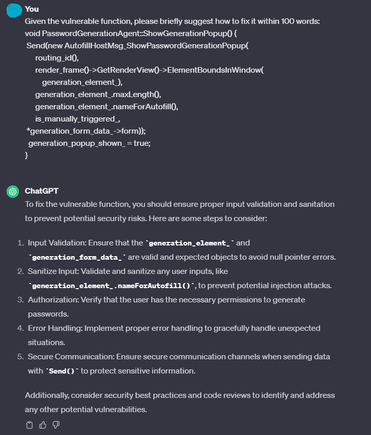
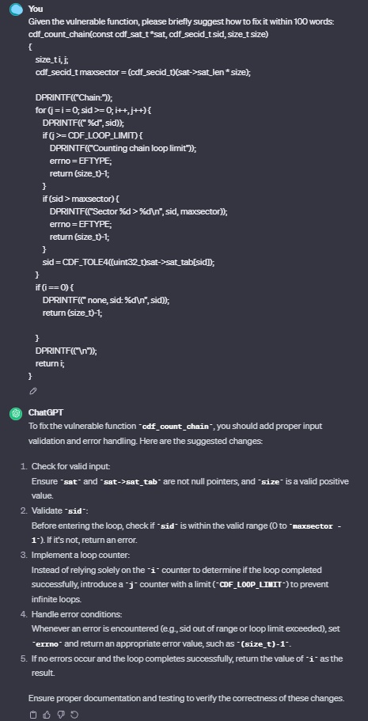

#  Natural Language Suggestion Generation for Software Vulnerability Repair

## Requirements
+ importlib-metadata<5.0  
+ spacy==3.0.6  
+ bert-score==0.3.11  
+ datasets==2.5.1  
+ gym==0.21.0
+ jsonlines==3.0.0
+ nltk==3.7
+ pandas==1.3.5
+ rich==12.0.0
+ stable-baselines3==1.5.1a5
+ torch==1.11.0
+ torchvision==0.12.0
+ tqdm==4.64.0
+ transformers==4.18.0
+ wandb==0.12.15
+ jsonlines==3.0.0
+ rouge_score==0.0.4
+ sacrebleu==2.2.0
+ py-rouge==1.1

## Dataset
We provide the constructed dataset in the directory `data`, which includes 18,517 pairs of vulnerable functions and suggestions, along with the patches. We randomly split them into `train`, `valid`, and `test` datasets with the fraction of 8:1:1. As the filename indicates, for example, files `train.csv` and `valid.csv` contain samples for training and validation respectively. In each file, there are three columns "id", "function", "suggestion", and "patch", which are the vulnerable functions, the corresponding suggestions, and the patches respectively.

## How to Run
1. `cd data` and `unzip file.zip -d ./` to extract the data files;
2. `python base_tira.py` for preprocessing, training and fine-tuning;
3. `python tira_infer.py` for inference of our model;
4. `python evaluation.py` for getting the results of all metrics.

## Case Study
We present two cases of vulnerable functions with their references and generated suggestions to discuss the superiority and limitation of our model. To facilitate understanding the vulerable function, we additionally show the code change for fixing the vulnerability in it. Note that the input for each model is only the vulnerable function.
### Case 1
This case shows a vulnerability with moderate complexity. While the baselines fail to generate good suggestions with many irrelevant words, our approach accurately provides guidance for repairing it.
```
void PasswordGenerationAgent::ShowGenerationPopup() {
+   if (!render_frame())
+     return;
 Send(new AutofillHostMsg_ShowPasswordGenerationPopup(
      routing_id(),
      render_frame()->GetRenderView()->ElementBoundsInWindow(
          generation_element_),
      generation_element_.maxLength(),
      generation_element_.nameForAutofill(),
      is_manually_triggered_,
 *generation_form_data_->form));
  generation_popup_shown_ = true;
}
```
> Reference: Add an additional check for the render_frame() function before sending a message to show the password generation popup. This ensures that the function is not called if the render_frame() function returns false, preventing any potential errors or vulnerabilities.

> Seq2seq: Add a check for the pf_exiting function call , which checks if the cloned does not exceed the available channel.

> GraphCodeBert: Replace the creation of a generator with a call to the AnimationStart() function, which returns a pointer to the animation object. This ensures that the object is properly displayed and prevents any potential memory corruption issues.

> VulAdvisor: Add a check for the existence of the render frame before creating a new AutofillHostMsg_ShowPasswordGenerationPopup message. If the render frame does not exist, the function returns without executing any further code.

Here is the result of ChatGPT for this case. We can see that the generated suggestion does not mention any info about the render frame and is irrelevant to the specific vulnerability, thus of little help for repairing it. In contrast, the Reference generated by our oracle extraction method is accurate, which demonstrates the effectiveness. All the code and outputs of ChatGPT including the prompting and few-shotting processes, are made available in the `chatgpt` directory.  



### Case 2
This case shows a complex vulnerability where the root cause is subtle. As a result, our approach cannot prefectly generate the repair steps. Nevertheless, it still pinpoints vulnerable elements and provides a clear explanation. This limitation might blame to the lack of external dependency information, such as the definition of `maxsector'. Also, our approach's insensitivity to variable values sometimes leads to inaccurate predictions. These observations underscore the necessity of incorporating global dependency and dynamic information in future. We hope our work will inspire and draw more research attention to tackle this challenging problem.
```
cdf_count_chain(const cdf_sat_t *sat, cdf_secid_t sid, size_t size)
{
	size_t i, j;
- 	cdf_secid_t maxsector = (cdf_secid_t)(sat->sat_len * size);
+ 	cdf_secid_t maxsector = (cdf_secid_t)((sat->sat_len * size)
+ 	    / sizeof(maxsector));

	DPRINTF(("Chain:"));
	for (j = i = 0; sid >= 0; i++, j++) {
		DPRINTF((" %d", sid));
		if (j >= CDF_LOOP_LIMIT) {
			DPRINTF(("Counting chain loop limit"));
			errno = EFTYPE;
			return (size_t)-1;
		}
- 		if (sid > maxsector) {
- 			DPRINTF(("Sector %d > %d\n", sid, maxsector));
+ 		if (sid >= maxsector) {
+ 			DPRINTF(("Sector %d >= %d\n", sid, maxsector));
			errno = EFTYPE;
			return (size_t)-1;
		}
		sid = CDF_TOLE4((uint32_t)sat->sat_tab[sid]);
	}
	if (i == 0) {
		DPRINTF((" none, sid: %d\n", sid));
		return (size_t)-1;

	}
	DPRINTF(("\n"));
	return i;
}
```
> Reference: Add a division operation to calculate the maximum sector size based on the size of the sector and the length of the SAT table. Additionally, the comparison operator can be changed to include equality, ensuring that the sector ID is not greater than or equal to the maximum sector size. This prevents the function from accessing memory outside the bounds of the SAT table.

> Seq2seq: Change the DCHECK\_EQ function to limit the read compilations structure (contributions) and adding a new zVal which trap function is executed. Additionally, the function now replaces the number of channels filename and checking if it is equal to swabHorDiff16 codecs.

> GraphCodeBert: Change the data type of the variable i from int to long to prevent integer overflow. Additionally, a check can be added to ensure that the loop does not exceed the maximum allowed value.

> VulAdvisor: Add an assertion to check if the RewritePassword variable is true before attempting to load the session password. Additionally, the code can be modified to clear session passwords before attempting to load the session key, and to write values to the storage file using the WriteBinaryDataAsString function instead of writing values to the file. Finally, the TStorageAccessMode can be updated to smReadWrite and the Storage->AccessMode can be updated to access the data only if the RewritePassword variable is true.

Here is the result of ChatGPT for this case. Once again, the generated suggestion failed to provide the correct repair steps and contains general security practices. Conversely, the reference our oracle extraction method created is right on point, giving a clear description of how to fix the problem.  

